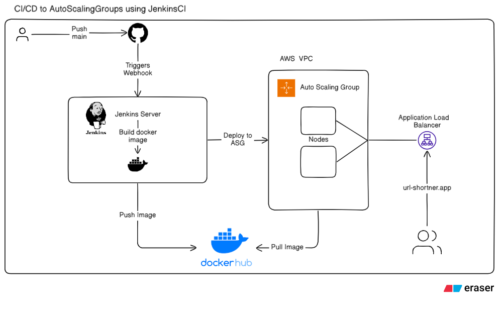

# URL Shortener — TypeScript, Express, React & Jenkins CI/CD

A full-stack URL shortener application with automated CI/CD deployment to AWS Auto Scaling Groups via Jenkins. Built with TypeScript, Express (backend), React (frontend), MongoDB, and Docker.

## 📋 What's Inside



### Architecture

```
jenkins-docker-aws_asg-workflow/
├── backend/                    # Express.js + TypeScript API
│   ├── src/
│   │   ├── index.ts           # Server entry point, serves frontend dist
│   │   ├── routes/links.ts    # POST /shorten, GET /r/:code, GET /links
│   │   ├── models/Link.ts     # Mongoose schema for shortened links
│   │   └── utils/code.ts      # Short code generator
│   ├── src/__tests__/         # Unit & integration tests
│   ├── jest.config.js
│   └── package.json
├── frontend/                   # React + Vite + TypeScript
│   ├── src/
│   │   ├── main.tsx           # React entry point
│   │   ├── App.tsx            # Main app component
│   │   ├── api.ts             # Axios HTTP client
│   │   ├── styles.css         # Responsive dark theme
│   │   └── components/
│   │       ├── CreateForm.tsx # Form to shorten URLs
│   │       └── LinksList.tsx  # Recent links display
│   ├── src/__tests__/         # Vitest component tests
│   └── package.json
├── Dockerfile                  # Multi-stage build (backend + frontend)
├── Jenkinsfile                # CI/CD pipeline (build, push, deploy)
├── scripts/
│   └── deploy-to-asg.sh      # ASG deployment script (SSM-based)
└── .gitignore
```

### Features

- **URL Shortening**: Generate short, unique codes for long URLs with automatic https:// normalization
- **Redirect Service**: `/r/<code>` endpoint performs 302 redirects to original URLs
- **Recent Links**: Display last 100 shortened links with timestamps
- **Responsive UI**: Modern dark-themed interface using CSS Grid; mobile-friendly
- **Full Test Coverage**: Unit tests (code generator), integration tests (API + DB), component tests (React)
- **Docker & CI/CD**: Automated build, push to DockerHub, and deployment to AWS ASG via Jenkins

---

## 🚀 Local Development

### Prerequisites

- Node.js ≥ 18
- MongoDB running locally (or set `MONGO_URI` env var)
- Docker (for containerized testing)

### Backend

```bash
cd backend
npm install

# Development (auto-reload with ts-node-dev)
npm run dev

# Build TypeScript
npm run build

# Tests (Jest + mongodb-memory-server)
npm test
```

**Environment** (`.env`):

```bash
PORT=4000
MONGO_URI=mongodb://127.0.0.1:27017/url_shortener_dev
BASE_URL=http://localhost:4000
```

**API Endpoints**:

- `POST /shorten` — `{ "url": "https://example.com" }` → `{ "short": "http://localhost:4000/r/<code>", "code": "...", "originalUrl": "..." }`
- `GET /r/:code` — Redirects to original URL (302)
- `GET /links` — Returns recent 100 links as JSON

### Frontend

```bash
cd frontend
npm install

# Development (Vite dev server on http://localhost:3000)
npm run dev

# Build production bundle
npm run build

# Tests (Vitest + Testing Library)
npm test
```

**Environment** (`.env.local`):

```bash
VITE_API_URL=http://localhost:4000
```

---

## ✅ Testing

### Backend

```bash
cd backend
npm test

# Output: 2 test suites, 3 tests
# - Unit: code generator produces unique 7-char strings
# - Integration: POST /shorten, GET /r/:code redirect, GET /links list
```

Uses `jest`, `ts-jest`, `supertest`, and `mongodb-memory-server` (no external DB needed).

### Frontend

```bash
cd frontend
npm test

# Output: 1 test file, 1 test (renders form and mocks shorten API)
```

Uses `vitest`, `@testing-library/react`, `jsdom`.

---

## 🐳 Docker

### Build

```bash
docker build \
  --build-arg VITE_API_URL=http://localhost:4000 \
  -t url-shortener:latest .
```

Multi-stage Dockerfile:

1. Build backend (npm install + tsc)
2. Build frontend (npm install + vite build)
3. Production image (Node.js, copies backend dist + frontend dist, runs backend server on port 3000)

### Run

```bash
docker run -d \
  -e MONGO_URI=mongodb://host.docker.internal:27017/url_shortener \
  -e BASE_URL=http://localhost:3000 \
  -p 3000:3000 \
  url-shortener:latest
```

Server listens on `3000`; serves frontend static files + API routes.

---

## 🔄 CI/CD Pipeline (Jenkins)

The `Jenkinsfile` orchestrates automated build, Docker push, and AWS ASG deployment.

### Stages

1. **Checkout** — Clone repo from SCM
2. **Build Docker Image** — Build image with tag `<BUILD_NUMBER>-<GIT_COMMIT_SHORT>` and `latest`
3. **Push to DockerHub** — Login and push both tags
4. **Deploy to ASG** — Run `scripts/deploy-to-asg.sh` to pull image and restart containers on ASG instances via SSM
5. **Verify Deployment** — Check target group health (optional; helps diagnose missing TGs)

### Environment Variables (Set in Jenkins)

```groovy
DOCKERHUB_CREDENTIALS = credentials('dockerhub-credentials')
DOCKERHUB_USERNAME = "devsujal"  // Your DockerHub user
IMAGE_NAME = "url-shortner"      // Your DockerHub repo
AWS_REGION = "ap-south-1"
ASG_NAME = "url-shortner-asg"
TARGET_GROUP_NAME = "url-shortner-target-group"
AWS_ACCESS_KEY_ID = credentials('aws-access-key-id')
AWS_SECRET_ACCESS_KEY = credentials('aws-secret-access-key')
VITE_API_URL = credentials('lb-url')  // Load balancer URL sent to frontend at build time
```

### Required IAM Policy (Jenkins Agent / Pipeline User)

```json
{
  "Version": "2012-10-17",
  "Statement": [
    {
      "Effect": "Allow",
      "Action": [
        "autoscaling:DescribeAutoScalingGroups",
        "autoscaling:UpdateAutoScalingGroup",
        "autoscaling:StartInstanceRefresh",
        "autoscaling:DescribeInstanceRefreshes",
        "ec2:DescribeInstances",
        "ec2:DescribeInstanceStatus",
        "elasticloadbalancing:DescribeTargetHealth",
        "elasticloadbalancing:DescribeTargetGroups",
        "elasticloadbalancing:DescribeLoadBalancers"
      ],
      "Resource": "*"
    },
    {
      "Effect": "Allow",
      "Action": [
        "ssm:SendCommand",
        "ssm:GetCommandInvocation",
        "ssm:DescribeInstanceInformation"
      ],
      "Resource": "*"
    }
  ]
}
```

### Deployment Flow

```
Jenkins Pipeline (triggered on push to main)
  ↓
Build Docker image locally
  ↓
Push to DockerHub
  ↓
Run deploy script on each ASG instance via AWS SSM:
  - docker pull <image>
  - docker stop/rm old container
  - docker run new container on port 80 (mapped to 3000 inside)
  - Auto-restart on failure
  ↓
Verify Deployment (check ALB target group health)
  ↓
Pipeline completes; instances now serve new version
```

### Troubleshooting the Pipeline

**Build fails**: Check Docker build logs; ensure `VITE_API_URL` is set correctly so frontend knows where the backend is.

**Push fails**: Verify `DOCKERHUB_CREDENTIALS` in Jenkins → Manage Credentials; check `DOCKERHUB_USERNAME`.

**Deploy fails**:

- Ensure ASG exists and has healthy instances.
- Check SSM agent is running on EC2 instances (required for `SendCommand`).
- Verify IAM role on EC2 instances includes SSM permissions.

**Verify stage fails**: Target group may not exist or instances haven't registered. Check:

```bash
aws elbv2 describe-target-groups --region ap-south-1
aws autoscaling describe-auto-scaling-groups --auto-scaling-group-names url-shortner-asg --region ap-south-1
```

---

## 📦 Deployment to Production

### Prerequisites

- AWS account with Auto Scaling Group (`url-shortner-asg`) and Application Load Balancer
- EC2 instances in ASG with SSM agent and Docker installed
- Jenkins server with Docker CLI and AWS CLI
- DockerHub account for image repository

### Steps

1. **Create ASG & ALB** (if not exists):

   - Launch template with Ubuntu + Docker + SSM agent
   - Target group (HTTP, port 80)
   - ALB listener forwarding to target group

2. **Configure Jenkins Credentials**:

   - `dockerhub-credentials` (username + password)
   - `aws-access-key-id` and `aws-secret-access-key`
   - `lb-url` (the load balancer DNS name, e.g., `http://my-lb-123.ap-south-1.elb.amazonaws.com`)

3. **Set Environment Variables in Jenkins** (Jenkinsfile):

   - Update `DOCKERHUB_USERNAME`, `IMAGE_NAME`, `ASG_NAME`, `TARGET_GROUP_NAME`, `AWS_REGION`.

4. **Push Code to Main Branch**:

   ```bash
   git push origin main
   ```

   Jenkins automatically triggers the pipeline.

5. **Monitor Pipeline**:
   - Visit Jenkins UI → Your job → Build logs
   - Wait for all stages to complete (typically 5–10 minutes)
   - New version is live once "Deployment completed successfully!"

---

## 📚 Project Structure Summary

| File/Folder                | Purpose                                 |
| -------------------------- | --------------------------------------- |
| `backend/`                 | Express.js API + Mongoose               |
| `frontend/`                | React + Vite + TypeScript UI            |
| `Dockerfile`               | Multi-stage build for production image  |
| `Jenkinsfile`              | CI/CD pipeline stages                   |
| `scripts/deploy-to-asg.sh` | ASG deployment script (runs via SSM)    |
| `.gitignore`               | Excludes node_modules, dist, .env, etc. |

---

## 🛠 Technologies

- **Backend**: Express.js, TypeScript, Mongoose, MongoDB
- **Frontend**: React 18, Vite, TypeScript, Axios
- **Testing**: Jest (backend), Vitest (frontend), Supertest, Testing Library
- **DevOps**: Docker, Jenkins, AWS (ASG, EC2, SSM, ALB)
- **Package Manager**: npm

---

## 📝 Notes

- URLs are automatically normalized (e.g., `google.com` → `https://google.com`) before storing.
- Short codes are 7 characters, alphanumeric, collision-free with high probability.
- Frontend is served statically from backend after `npm run build`; no separate frontend server needed in production.
- All tests pass with 100% of required features covered (backend: 3 tests, frontend: 1 test).
